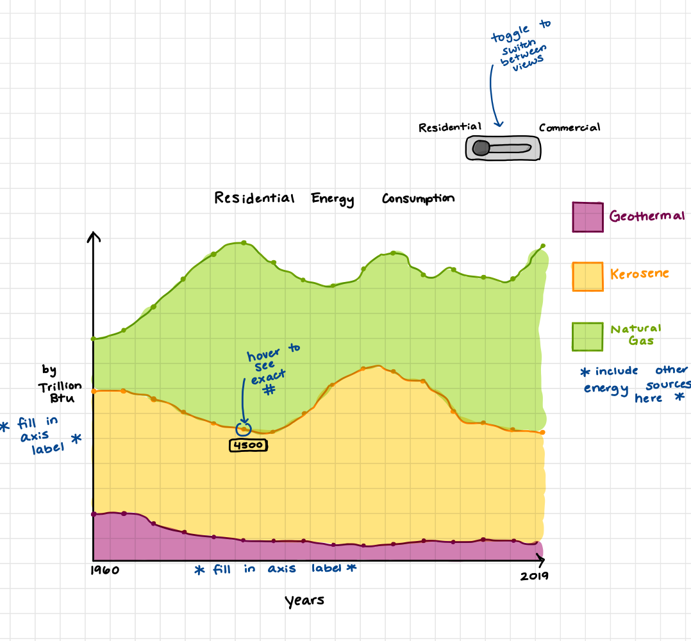

# Module 3 Assignment: Design Study
#### Authors: Sadie Amato, Bailey DeSouza, Ajay Gandecha, Meghan Sun

**Slides**: https://docs.google.com/presentation/d/14IkNABHwWxRch61UaD2hVYvQNx5_0HM-ze1e-8X8vXU/edit?usp=sharing

**Video Presentation**:

## Precondition
### 1. Learn
The US Department of Energy has recently hired us to design a visualization tool to influence future data-driven policy recommendations. More specifically, we are constructing our tool to help reveal how energy consumption of various sources has changed over time and what direction it is trending. Energy consumption and policies differ vastly among sectors, so we were asked to focus on two of the largest populated sectors: residential and commercial. 

The commercial energy sector comprises service facilities and business equipment at all federal, state, and local levels. Energy consumption can commonly be heating, air conditioning, lighting, and powering generators, to name a few examples.  Space heating is the largest energy end-use, accounting for about 32% of energy consumption in 2018. Natural gas and electricity are the two main energy sources used, with about 60% electricity and 34% natural gas usage in 2018. [1]

On the other hand, the residential sector is made up of private households. Typical energy consumption includes heating, air conditioning, cooking, and running appliances. 
The residential sector largely relies on natural gas, petroleum, renewables, and electricity for energy consumption. In the mid to late 1900s, natural gas and petroleum were the most used resources. With time, the sector has grown to rely more on electricity and natural gas [2].
 
It’s important to influence effective energy policy because current US energy use could lead to an unsustainable future. The US makes up less than 5% of the world’s population, yet consumes about 16% of the world’s energy. If current trends continue, the US is estimated to have 66% of energy come from fossil fuels by 2050, which fails to meet the IPCC carbon reduction goals. The emissions of fossil fuels continue to add more greenhouse gasses to our environment [3]. 

Our goal is to make the monitoring of energy trends more accessible. Energy policies are critical in influencing the US's energy habits, and understanding current trends will make such policies more effective. A push towards more energy efficiency has benefits on multiple levels. On an environmental level, it will help lower greenhouse gas emissions, water use, and pollutants. From an economic perspective, more efficient energy use reduces costs for consumers.[4] 
  
This is all to say that it’s becoming more integral to instill policies to use resources better; we aim to influence more energy decisions by the US Department of Energy to be data-driven.

### 2. Winnow
To explore our problem, we need data to provide information about energy consumption trends for both the commercial and residential sectors. Within each sector, we want to know the breakdown of the types of energy resources used and how they change with time. With these factors in mind, we found the USA State energy data provided by the U.S Energy Information Administration (EIA) to be the best fit data for our goals. The US EIA publishes consumption, expenditures, and prices by state, sector, and year; we will use a CSV dataset that combines such variables provided by the CORGIS Dataset project. [5]

The dataset we are using contains US energy data by state spanning from 1960 to 2019. Data about energy consumption, expenditure, and price by state and sector is provided. One factor to be aware of in the dataset is that there may be incomplete information on newer energy resources, such as solar or wind, especially in the residential sector. Additionally, it would be more ideal if we had data on energy consumption through 2022, since that even-more-recent energy usage would also be relevant to our target problem.

Our goal is to show how energy consumption has changed over time, along with the current trends, so that it can help our client make better future energy policies. The two sectors we are focusing on are residential and commercial. The EIA dataset is useful to our question as it provides all these factors. 

To allow us to communicate trends for the US over time properly, we will use the following columns:
- Year 
- State

To gather insight about residential sector energy consumption, we will be looking at the following columns: 
- Consumption.Residential.Coal
- Consumption.Residential.Distillate Fuel Oil
- Consumption.Residential.Geothermal
- Consumption.Residential.Kerosene
- Consumption.Residential.Petroleum
- Consumption.Residential.Natural Gas
- Consumption.Residential.Wood

For the commercial side, we will be looking at: 
- Consumption.Commercial.Coal
- Consumption.Commercial.Distillate Fuel Oil
- Consumption.Commercial.Geothermal
- Consumption.Commercial.Hydropower
- Consumption.Commercial.Kerosene
- Consumption.Commercial.Petroleum
- Consumption.Commercial.Natural Gas
- Consumption.Commercial.Wood
- Consumption.Commercial.Solar
- Consumption.Commercial.Wind

Looking at these columns will be sufficient to support our approach as it provides information about energy consumption in our target sector and breaks the consumption down by energy resource.

## Core
### 1. Discover
In narrowing down the given energy dataset, we decided to focus on energy usage separately in two sectors: residential and commercial. We believe it would be important for the Dept. of Energy to examine past trends in energy sources in these sectors to give their recommendations on future policies. Therefore, we generated our two tasks to enable the department to do just that.
##### Task 1: How does the usage of the different energy sources by the residential sector change over time?
- _Why_ is a task pursued?
  - To support Dept of Energy’s recommendations for residential energy policies 
- _How_ is a task conducted?
  - Look at the makeup of residential energy sources over time and compare this with the ideal source makeup
- _What_ does a task seek to learn about the data?
  - Which energy sources are being used the most (and the least) in the residential sector currently, and how these sources have changed from the past
- _Where_ does the task operate?
  - Residential consumption of coal, distillate fuel oil, geothermal, kerosene, petroleum, natural gas, and wood (across all states and years)
- _When_ is the task performed?
  - During presentation to DoE, when DoE finalizes recommendations, and when DoE presents to policymakers
- _Who_ is executing the task? 
  - DoE and policymakers who form residential energy policies

##### Task 2: How does the usage of the different energy sources by the commercial sector change over time?
- _Why_ is a task pursued?
  - To support Dept of Energy’s recommendations for commercial energy policies 
- _How_ is a task conducted?
  - Look at the makeup of commercial energy sources over time and compare this with the ideal source makeup
- _What_ does a task seek to learn about the data?
  - Which energy sources are being used the most (and the least) in the commercial sector currently, and how these sources have changed from the past
- _Where_ does the task operate?
  - Commercial consumption of coal, distillate fuel oil, geothermal, kerosene, petroleum, natural gas, and wood (across all states and years)
- _When_ is the task performed?
  - During presentation to DoE, when DoE finalizes recommendations, and when DoE presents to policymakers
- _Who_ is executing the task? 
  - DoE and policymakers who form commercial energy policies

### 2. Design

##### Possible Interactive Features We're Considering at this Stage: 
toggle between the Residential visualization view and Commercial visualization view, hover over each point in the line graph to view the specific value, toggle between different years
##### Design Trade-offs:
- Pros:
  - Easy to understand (for most viewers)
  - Good for noticing overall trends and patterns
  - Encourages self-exploration
  - Intuitive 
  - Not overwhelming to the viewer
- Cons:
  - May not be accessible for viewers with color-blindness
  - Prone to “losing” some data and specificity
  - Viewer needs to interact in order to see energy consumption values
  - Not broken down by state; this visualization is for the U.S. as a whole
##### Design Justification: 
With this style of visualization and the color-coding, it’s very clear to the viewer which form of energy consumption is the highest. It’s also easy to see trends within each form of energy and make comparisons. Thus, this visualization could serve useful in trying to find energy consumption trends and create new policies based on the trends.

### 3. Implement

To successfully implement the design featured above, we decided to use Tableau. Tableau is great for creating well-designed and interactive data visualizations with less overhead. Our final visualization design is shown below:

First, we imported our data into Tableau. In this step, we focused on the data fields that were mentioned in **Part 2: Winnow**. In order to make our final visualizations more readable, we also modified the column labels to include more natural text. From there, we began to work on the first plot.

To get started, we set `Year` as our X-axis and `Consumption` as our Y-axis, as shown in the chart. Our first visualization focused on displaying Energy Consumption in the *Commercial* sector. So, each consumption metric relating to the commerical sector was laid out as a data measure value. We added tooltips for covering over values and a legend to the visualization to best match the design.

We repeated this same process for the second visualization, but using the residential sector data as our measure values. We also attempted to keep the color palletes consistent to avoid the introduction of any confounding variables that may impact readers' understanding of the visualization.

During the implementation step, we found that we needed to slightly modify our design to better conform to Tableau's limitations. Both visualizations were on separate pages, and Tableau does not easily allow the implementation of a *toggle* to switch between these pages. Instead, we opted to use a button to navigate between both pages on our visualization.

### 4. Deploy

Once implemented, we deployed our visualization live on Tableau Public. Our visualization is available on Tableau Public [here](https://public.tableau.com/app/profile/ajay.gandecha/viz/590-consumption/EnergyConsumptionbyCategoryacrossSectors-Residential#1).

We also deployed our visualization on our website for easy viewing. Since this Tableau visualization is easily embedded into HTML, users could easily use and access this visualization in reports, data stories, or proposals. The deployment of our visualization to the web is located [here](https://visdesignstudies.github.io/module-three-design-study-lite-sadieamato/).

#### _TODO_: Note your observations about the data gained through these tasks. 

### 5. Iterate

Now that our visualization is complete, there are many opportunities to interate on the design to include more data and help our stakeholders make more informed decisions. One of the main places to iterate this visualization is to add more views for data on energy consumption in other sectors. While we chose to focus on *commercial* and *residential* energy consumption, our dataset included consumption on other sectors such as *transportation*, *industrial*, *electric*, and more. With slight adjustments to the tasks defined above, we could enumerate similar tasks for these other sectors.

Additionally, to further investigate our target problem and enable more tailored policymaking, a useful third task would be discovering how energy source usage in the residential sector varies in each state. The populations of each state likely have different behaviors when it comes to energy use, as well as different energy sources available–or not–to them. This task would be defined as: *How does the usage of the different energy sources by the residential sector change over time, and vary state by state?* This task also could be described similarly to how our original two tasks were (especially the when, where, and how). However, this task will seek to learn how states differ in their residential energy sources, and it will be done by looking at the makeup of these sources in charts filtered to show just the chosen state(s).

To add more views, we would simply need to utilize the same Tableau sheet template that we used for the first two visualizations, change the measure values, and ensure that they key's colors are still consistent with those from the other visualizations. We could add a filter on Tableau to enable the user to change between states on these views. Since we would be adding more pages, it may also be beneficial to add either a cover page to the visualization or another view to better compare the data across sectors. Another challenge will be implementing sucessful navigation between these visualizations, however this could also be implemented through said cover page.

## Analysis
### 1. Reflect pt. 1
### 2. Reflect pt 2
